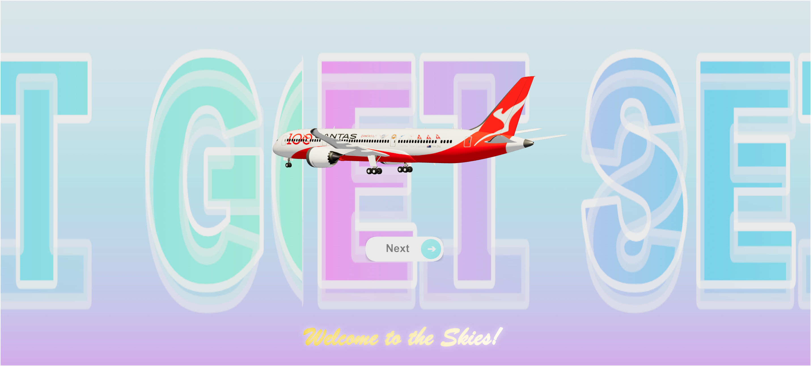

# JetSetGo ✈️

 <!-- Replace with your actual banner image path -->

An immersive 3D travel experience built with React, Three.js, and Vite. JetSetGo showcases stunning destinations with smooth animations and interactive elements.

## Features

- 🌍 Interactive 3D travel destination cards
- ✨ Smooth animations and transitions
- 🎨 Custom shaders and post-processing effects
- 📱 Fully responsive design
- ⚡ Optimized performance with Vite

## Technologies Used


## Project Structure

jetsetgo/
├── public/               # Static assets
│   ├── images/           # Destination images
│   └── env/              # Environment maps
├── src/
│   ├── components/       # React components
│   ├── utils/            # Utility functions
│   ├── App.jsx           # Main application
│   └── main.jsx          # Entry point
├── vite.config.js        # Vite configuration
└── package.json


## Installation

```bash
# Clone the repository
git clone https://github.com/yourusername/jetsetgo.git

# Navigate to project directory
cd jetsetgo

# Install dependencies
npm install

# Start development server
npm run dev


